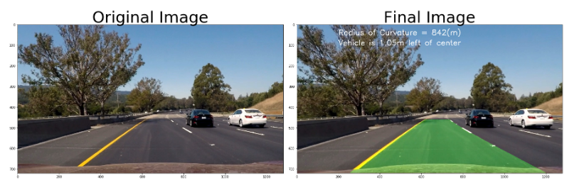
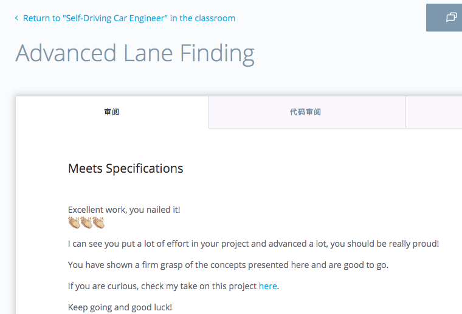

# 无人驾驶(纳米学位)-第一学期-项目2-高级车道线检测
# CarND-Term1-Project2-Advanced_Lane_Line_Finding

This is the 2nd project in Term 1 for the **Self-Driving Car Engineer** Nanodegree program at [Udacity](https://cn.udacity.com/course/self-driving-car-engineer--nd013)

The goals / steps of this project are the following: 

* Compute the camera calibration matrix and distortion coefficients given a set of chessboard images.
* Apply a distortion correction to raw images.
* Use color transforms, gradients, etc., to create a thresholded binary image.
* Apply a perspective transform to rectify binary image ("birds-eye view").
* Detect lane pixels and fit to find the lane boundary.
* Determine the curvature of the lane and vehicle position with respect to center.
* Warp the detected lane boundaries back onto the original image.
* Output visual display of the lane boundaries and numerical estimation of lane curvature and vehicle position
* Output video with lane lines detected drawn
 
 Here is the Project file [Proj2-Adv-LaneLines.ipynb](./Proj2-Adv-LaneLines.ipynb)   
 Note:  you may use https://nbviewer.jupyter.org/ to quickly load .ipynb file  
 
 Helper files where useful functions are implemented:
 - [imageHelper.py](./imageHelper.py)  
 - [laneHelper.py](./laneHelper.py)  

 
 Here is my  [Project Report/Writeup](./Project-Writeup.md)   
 Learn about [Project Requirements](./Project-README.md)
 
---
#### Example output 
[output video - Adv_out_video.mp4](./Adv_out_video.mp4)  

---
#### Certificate for the Project Completion

